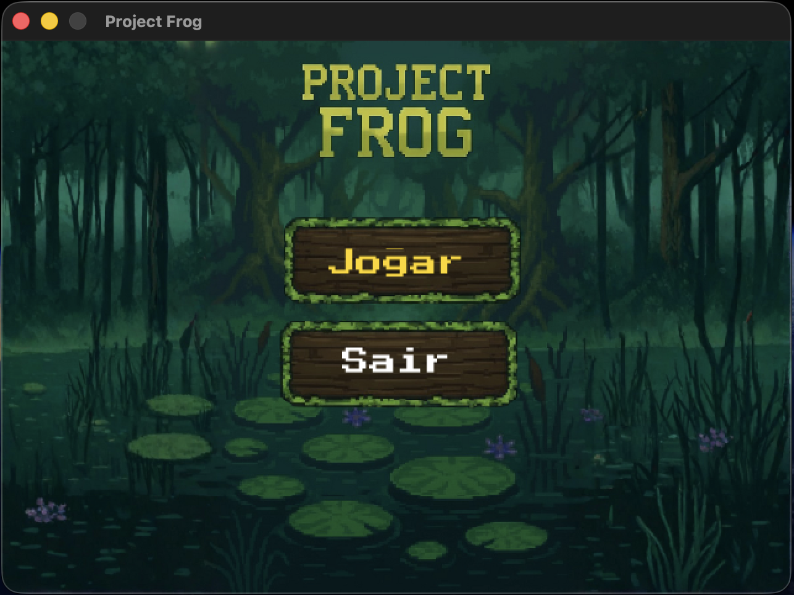
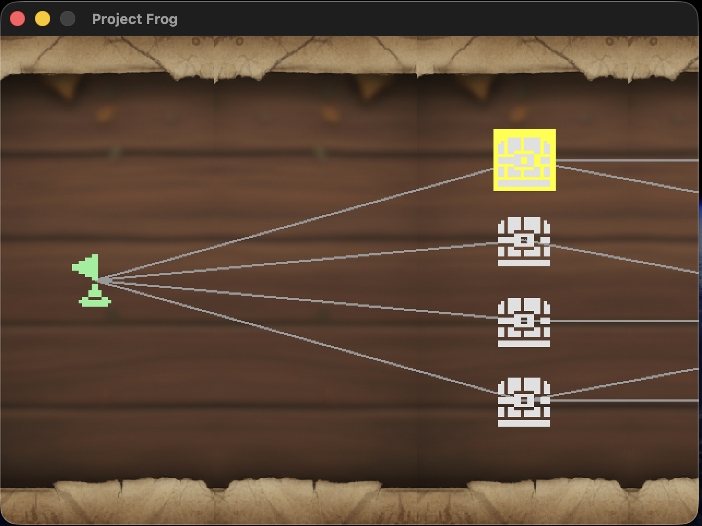
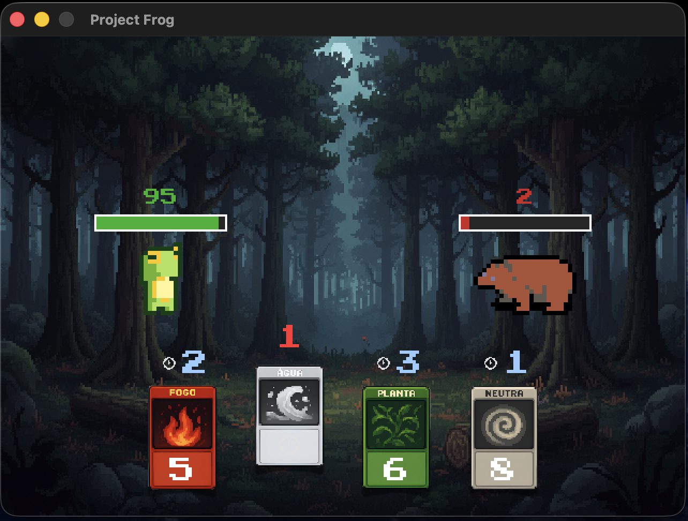
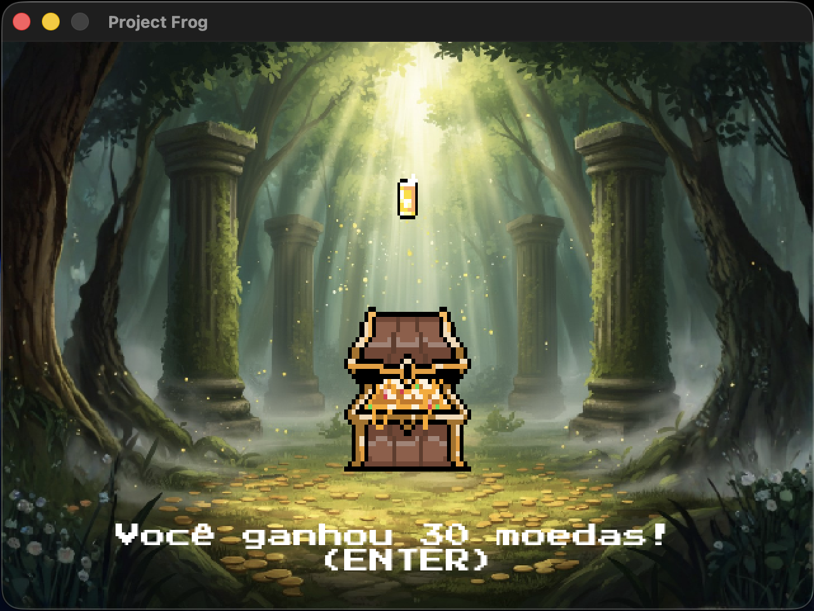

# Project-Frog
Jogo Roguelike - Projeto final da disciplina de Desenvolvimento de Jogos Digitais UFMG

Project Frog é um jogo roguelike com combate de turnos com grande inspiração em jogos como "Slay The Spire" e "Card Jutsu" (Club Penguim). O jogador deve planejar seu caminho pelo mundo e escolher seu destino em trilhas de combate, tesouros, lojas misteriosas e descansos, pois nenhum guerreiro é de ferro.

O jogador inicia sua jornada com 4 cartas e deve coletar ao longo de seu caminho cartas raras e mais poderosas em busca de alcançar seu objetivo final. Fogo, água, planta e neutro, escolher as melhores combinações é vital para o progresso.

A cada tentativa o jogador deve encarar um mapa novo e utilizar os conhecimentos de suas tentativas passadas para alcançar o final e levar o sapo a glória eterna!

## Screenshots

### Menu Principal

*Tela inicial do jogo com opções de começar nova jornada ou sair*

### Mapa

*Mapa procedural com diferentes tipos de nós: combates, tesouros, lojas e descansos*

### Combate

*Sistema de combate baseado em turnos com mecânica de elementos (fogo, água, planta e neutro)*

### Recompensas - Cartas

*Tela de recompensa após vitória em combate, permitindo escolher novas cartas para o deck*

### Recompensas - Moedas

*Coleta de moedas que podem ser usadas na loja para comprar itens e melhorias*

## Funcionalidades a serem testadas

- Mapas aleatórios a cada tentativa;
- Mecânica de combate de turnos: vitória por elemento/poder da carta;
- Decisão correta de quem vence o turno;
- Cooldown das cartas;
- Itens recebidos pelo baús (após vitória em combate, após nó de baú no mapa ou pela loja);
- Animações dos ataques e personagens nas cenas;
- Itens funcionais da loja + recuperação após o descanso;

## Créditos

**Facundo Sanchez**
-  Programação e enemy/player design;

**Kayque Meira Siqueira**
- Programação e música/aúdio;

**Marcos Lott de Araújo**
- Programação, arte e level design;

**Rubens da Cunha Castro**
- Programação, arte e game design;
